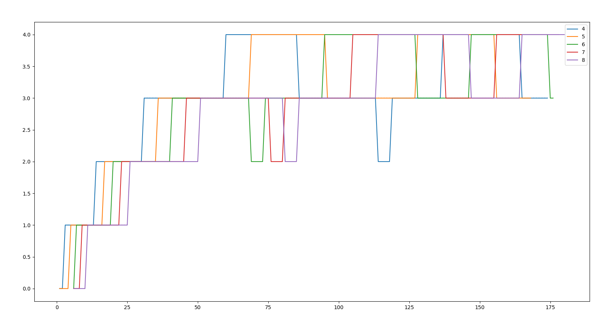

# Assignment 5: Enhancing xv6 OS

## Task 1

### waitx

`int waitx(int *, int *);`

This syscall returns the time for which a process was waiting (excluding I/O time) and for which the process was running. The return value is same as the `int wait(void);` syscall i.e. the pid of one process that is zombie if successful and `-1` if unsuccessful.

There are some additions to the proc structure to implement this syscall
1. `ctime` was assigned when the process is created.
2. `rtime` is incremented at every tick if the process's state is `RUNNING` 
3. `iotime` is incremented at every tick if the process's state is `SLEEPING` 
4. `etime` is assigned when the process exits

`wtime` is calculated as `etime-ctime-rtime-iotime`, i.e. whenever it was not running or doing I/O, it was waiting.

To demonstrate the syscall a user program `time` command has been implemented

```
Usage:
time <command name to be timed>
```

---

### ps

`int my_ps(void);`

Things printed by ps are:
```
int pid
int priority
enum state
int rtime
int cur_waiting_time
int n_run
int queue_no
int ticks[5]
```

Some parameters like queue_no, ticks have a value of -1 when they are not vaild in that particular scheduling algorithm.

---

### set_priority

`int set_priority(int, int);`

This syscall takes the new priority for a process and returns its old priority. This value is ignored if scheduler is not PBS. IF the new priority is not valid, the priority is not changed

---

## Task 2

The default scheduler of xv6 is a round-robin based scheduler. We had to implemente a few more scheduling algorithms.

### First come first serve (FCFS)

In this policy, the process with the lowest creation time is selected.

---

### Priority based scheduling (PBS)

In this policy, the process with the highest priority (lowest priority number) is selected. If priority is same then Round-Robin scheduling algorithm is run for processes having same and highest priority.

---

### Multi level feedback queue (MLFQ)

The implementation is the same as the assignment requirements so copy-pasting those requirements.

#### Scheduler details

1. Create five priority queues, with the highest priority being number as 0 and
the bottom queue with the lowest priority as 4.
2. Assign a suitable value for 1 tick of CPU timer.
3. ​ The time-slice for priority 0 should be 1 timer tick. The times-slice for priority 1
is 2 timer ticks; for priority 2, it is 4 timer ticks; for priority 3, it is 8 timer ticks;
for priority 4, it is 16 timer ticks.

#### Procedure:-
1. On the initiation of a process, push it to the end of the highest priority queue.
2. The highest priority queue should be running always, if not empty.
3. If the process completes, it leaves the system.
4. If the process uses the complete time slice assigned for its current priority
queue, it is preempted and ​ inserted at the end of the next lower level queue.
5. If a process voluntarily relinquishes control of the CPU, it leaves the queuing
network, and when the process becomes ready again after the I/O, it is​ ​ inserted
at the tail of the same queue, from which it is relinquished earlier​.
6. A round-robin scheduler should be used for processes at the lowest priority
queue.
7. To prevent starvation, implement the aging phenomenon:-
a.​ If the wait time of a process in lower priority queues exceeds a given
limit(assign a suitable limit to prevent starvation), their priority is
increased and they are pushed to the next higher priority queue.
b.​ The wait time is reset to 0 whenever a process gets selected by the
scheduler or if a change in the queue takes place (because of aging).

#### Answer to the question asked in the PDF

A process can exploite the above scheduler algorithm by doing a redundent I/O just before its time slice of a particular queue is getting over. The CPU would think that it is a I/O bound or interactive process but in reality the process could be an intensive CPU bound process. Still the process can ensure that it gets more priority and remain in a higher priority queue.

## Comparison

The same set of processes were ran under different  scheduling algorithm. They were running command `benchmark`. (NOTE my_ps() function was used to calculate the total waiting and running time of all the children spawned by benchmark. Also, my_ps() was modified to get the total waiting time of each process. These changes are commented out in the actual code)

|        | rtime | wtime |
| --- | --- | --- |
| `RR` | 448 | 1335 |
| `FCFS` | 443 | 671 |
| `PBS` | 448 | 786 |
| `MLFQ` | 446 | 1130 |

It can be seen that for processes which have same structure, all the algorithms have same running time but we can see that FCFS has the least waiting time. This means that the cpu spent very less time deciding which process to take up next and did not preempt the process which was running on it.

On the other side MLFQ has a longer waiting time as it takes more things into consideration and these decisions eat up CPU time thereby making the total waiting time more than FCFS.

## BONUS

This graph was plotted using python

